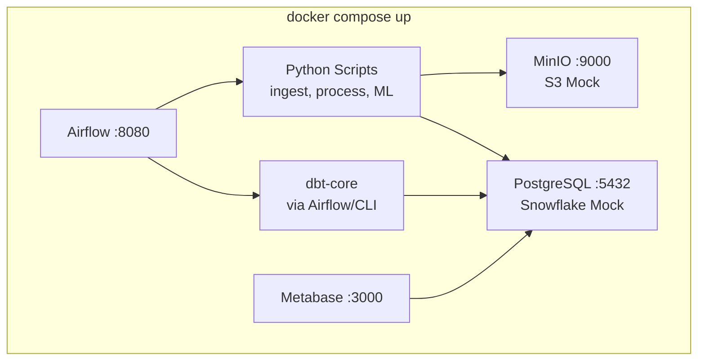
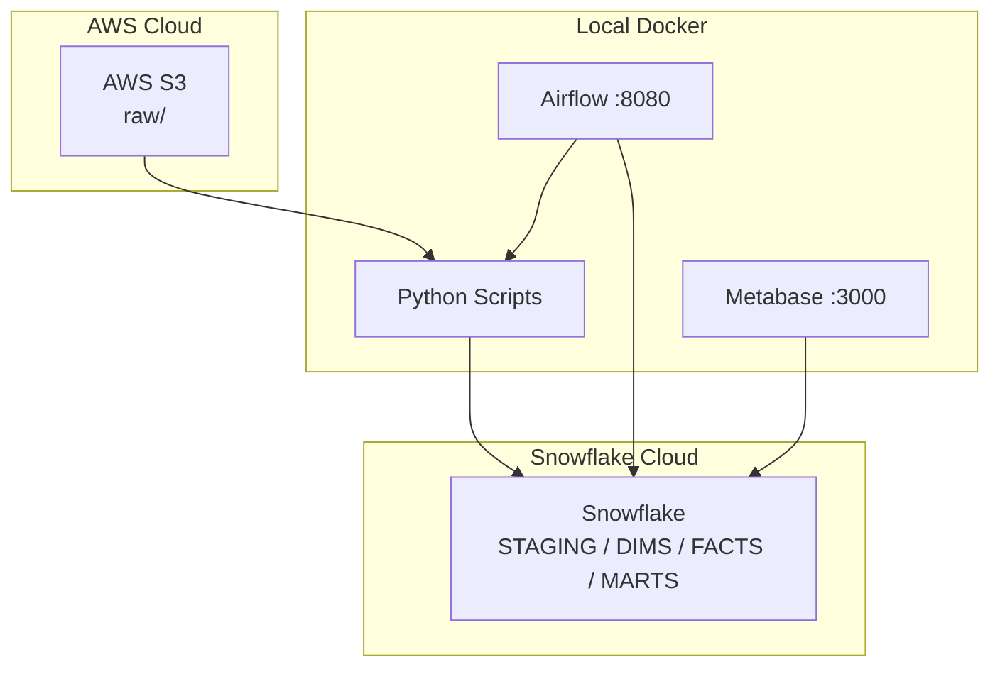
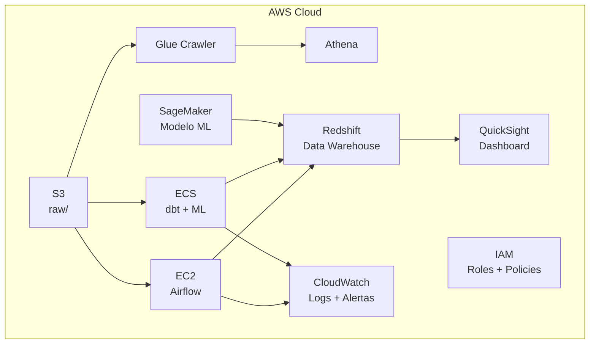

# Arquitetura

[[Home|Voltar ao índice]]

---

## Ambiente de Desenvolvimento (Docker)



### Serviços Docker

| Serviço | Imagem | Porta |
|---------|--------|-------|
| PostgreSQL | `postgres:16-alpine` | 5432 |
| MinIO | `minio/minio:latest` | 9000, 9001 |
| Airflow | `apache/airflow:2.9.0` | 8080 |
| Metabase | `metabase/metabase:latest` | 3000 |
| metabase-setup | `python:3.11-slim` | — |

---

## Ambiente de Produção (Híbrido)

Apenas **S3** e **Snowflake** são serviços externos reais. O restante permanece local.



> [!tip] Troca de ambiente
> Basta mudar 4 variáveis no `.env`. Ver [[11-Comandos#Ambiente]].

---

## Arquitetura 100% AWS (CloudFormation — Exercício Acadêmico)

> [!info] Documentada no CloudFormation como exercício. Na prática, apenas S3 é usado como serviço real.



> [!info] Detalhes do CloudFormation
> Ver [[10-Infra-AWS]] para a lista completa de recursos.

---

## Variáveis de Ambiente

### `.env.local` (Desenvolvimento)

```bash
S3_ENDPOINT=http://minio:9000
S3_ACCESS_KEY=minioadmin
S3_SECRET_KEY=minioadmin
DB_TYPE=postgres
DB_HOST=localhost
```

### `.env.prod` (Produção)

```bash
S3_ENDPOINT=https://s3.amazonaws.com
S3_ACCESS_KEY=<aws_access_key>
S3_SECRET_KEY=<aws_secret_key>
DB_TYPE=snowflake
DB_ACCOUNT=<snowflake_account>
```
