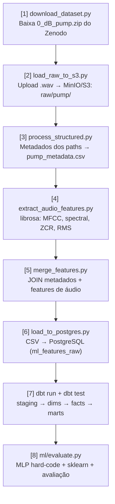

# Pipeline ELT — 8 Etapas

[[Home|Voltar ao índice]]

---

## Fluxo Completo



---

## Detalhamento por Etapa

### [1] Download Dataset

**Script:** `ingestion/download_dataset.py`
**Entrada:** Zenodo (`https://zenodo.org/records/3384388/files/0_dB_pump.zip`)
**Saída:** `data/raw/pump/`

- Baixa ~7,87 GB com barra de progresso via `requests`
- Suporta **retomada** de download interrompido (HTTP Range)
- Remove dados sintéticos legados (`model_id_XX/`) antes de extrair o dataset real
- Extrai o zip para `data/raw/pump/`

### [2] Upload para S3/MinIO

**Script:** `ingestion/load_raw_to_s3.py`
**Entrada:** `data/raw/pump/**/*.wav`
**Saída:** MinIO/S3 `raw/pump/`

- Usa `boto3` com `endpoint_url` configurável (MinIO em dev, AWS S3 em prod)

### [3] Extração de Metadados

**Script:** `processing/process_structured.py`
**Entrada:** `data/raw/pump/`
**Saída:** `data/processed/pump_metadata.csv`

- Percorre os paths (`machine_type`, `model_id`, `condition`)
- Normaliza `abnormal` → `anomaly` (`CONDITION_MAP`)
- Lê metadata dos arquivos com `soundfile` (`duration_sec`, `sample_rate`, `channels`)
- Gera `file_id` e o target `condition_binary` (anomaly=1)

### [4] Extração de Features de Áudio

**Script:** `processing/extract_audio_features.py`
**Entrada:** `data/raw/pump/**/*.wav`
**Saída:** `data/processed/audio_features.csv`

- Carrega cada `.wav` com `librosa.load(sr=16000, mono=True)`
- Extrai **92 features**: MFCC(40, média+desvio = 80), espectrais (10), ZCR e RMS (2)

> [!info] Features detalhadas
> Ver [[06-Machine-Learning#Features]] para a lista completa.

### [5] Merge

**Script:** `processing/merge_features.py`
**Entrada:** `pump_metadata.csv` + `audio_features.csv`
**Saída:** `data/processed/ml_features.csv`

- LEFT JOIN por `file_id`
- Preenche nulos com 0
- Resultado: 103 colunas (96 features numéricas)

### [6] Carga no PostgreSQL

**Script:** `processing/load_to_postgres.py`
**Entrada:** `data/processed/ml_features.csv`
**Saída:** tabela `public.ml_features_raw` (PostgreSQL)

- Insere via SQLAlchemy com `if_exists='replace'`

### [7] dbt (Run + Test)

**Comando:** `dbt run` → `dbt test`

**Modelos:** 5 (2 staging views, 1 dimensão, 1 fato, 1 mart)

> [!info] Schema estrela completo
> Ver [[05-Modelagem-dbt]] para os 5 modelos e 14 testes.

### [8] ML — Treinamento e Avaliação

**Script:** `ml/evaluate.py`
**Entrada:** `ml_features.csv`
**Saída:** Métricas comparativas, matrizes de confusão, `predictions.csv`, modelos `.pkl`, `report_analys.md`

- Baselines: DummyClassifier (majoritária) + Regressão Logística
- MLP hard-code (NumPy, 300 épocas) + MLPClassifier (sklearn)
- Split 80/20 com stratify + StandardScaler

> [!info] Detalhes do ML
> Ver [[06-Machine-Learning]].

---

## DAG Airflow

**Arquivo:** `dags/etl_pipeline.py`

**Schedule:** manual ou agendado

```python
# 8 tarefas sequenciais
download_dataset >> load_raw_to_s3 >> process_structured >> extract_audio_features
extract_audio_features >> merge_features >> load_to_postgres >> dbt_run >> dbt_test >> ml_train_evaluate
```

As tarefas são **sequenciais** (dependência de dados em cada etapa — o pipeline não tem tarefas paralelas, diferentemente da abordagem anterior com NLP ∥ CV).

---

## Comandos

```bash
make pipeline    # Dispara DAG completa via Airflow
make ingest      # Apenas download + upload S3
make process     # Metadados + features de áudio + merge
make load-db     # Carrega CSV no PostgreSQL
```
