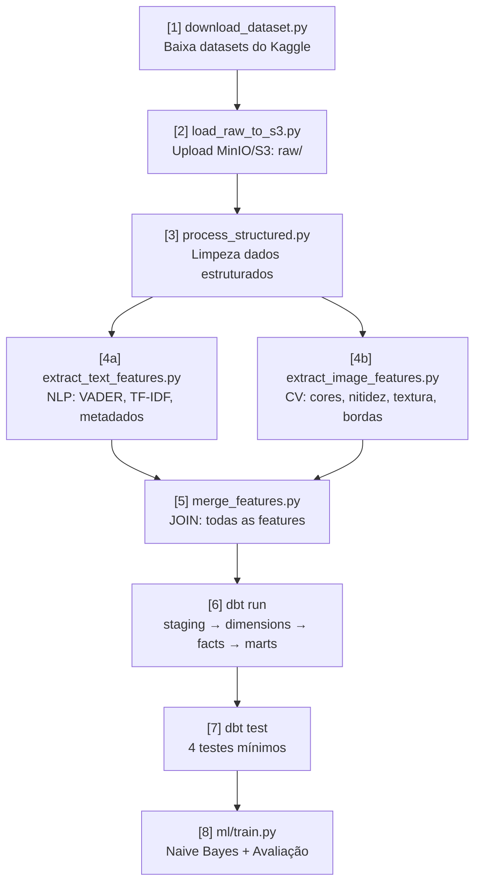

# Pipeline ELT — 8 Etapas

[[Home|Voltar ao índice]]

---

## Fluxo Completo



---

## Detalhamento por Etapa

### [1] Download Datasets

**Script:** `ingestion/download_dataset.py`
**Entrada:** API do Kaggle
**Saída:** `data/raw/amazon_sales.csv`, `data/raw/amazon_reviews.csv`

- Usa `kagglehub` para baixar ambos os datasets
- Valida se os arquivos foram baixados corretamente

### [2] Upload para S3/MinIO

**Script:** `ingestion/load_raw_to_s3.py`
**Entrada:** `data/raw/*.csv` + URLs de imagem
**Saída:** MinIO/S3 `raw/`

- Upload dos CSVs para o bucket
- Download das imagens via `img_link` e upload para `raw/images/`
- Usa `boto3` (compatível com MinIO e S3)

### [3] Processamento de Dados Estruturados

**Script:** `processing/process_structured.py`
**Entrada:** `raw/amazon_sales.csv`
**Saída:** `processed/products_clean.csv`

- Tratamento de nulos
- Deduplicação
- Padronização de tipos
- Transformações: log de preço, buckets de desconto

### [4a] Extração de Features de Texto (NLP)

**Script:** `processing/extract_text_features.py`
**Entrada:** `products_clean.csv`
**Saída:** `processed/reviews_features.csv`

> [!info] 217 features geradas
> Ver [[06-Machine-Learning#Features de Texto NLP]] para a lista completa.

### [4b] Extração de Features de Imagem (CV)

**Script:** `processing/extract_image_features.py`
**Entrada:** `raw/images/*.jpg`
**Saída:** `processed/images_features.csv`

> [!info] 28 features geradas
> Ver [[06-Machine-Learning#Features de Imagem CV]] para a lista completa.

### [5] Merge de Features

**Script:** `processing/merge_features.py`
**Entrada:** `products_clean.csv` + `reviews_features.csv` + `images_features.csv`
**Saída:** `processed/ml_features.csv`

- JOIN pelas chaves de produto
- Validação de integridade (sem nulos na target)

### [6] dbt Run

**Comando:** `dbt run`
**Modelos:** staging → dimensions → facts → marts

> [!info] Schema estrela completo
> Ver [[05-Modelagem-dbt]] para os 8 modelos e relacionamentos.

### [7] dbt Test

**Comando:** `dbt test`

| Teste | Modelo | Coluna |
|-------|--------|--------|
| `not_null` + `unique` | `dim_products` | `product_id` |
| `not_null` | `fact_reviews` | `review_id`, `rating` |
| `accepted_values` [1..5] | `fact_reviews` | `rating` |
| `unique` | `dim_categories` | `category_name` |

### [8] Treinamento ML

**Scripts:** `ml/hard_code/naive_bayes_hardcode.py`, `ml/sklearn/naive_bayes_sklearn.py`, `ml/evaluate.py`
**Entrada:** `ml_features` (mart do dbt)
**Saída:** Métricas comparativas

> [!info] Detalhes do ML
> Ver [[06-Machine-Learning]].

---

## DAG Airflow

**Arquivo:** `dags/etl_pipeline.py`

```python
# Schedule: @daily ou manual
download_task >> load_to_s3_task >> process_structured_task
process_structured_task >> extract_text_features_task
process_structured_task >> extract_image_features_task
[extract_text_features_task, extract_image_features_task] >> merge_features_task
merge_features_task >> dbt_run_task >> dbt_test_task >> ml_train_evaluate_task
```

As tarefas `4a` e `4b` rodam em paralelo (NLP e CV são independentes).

---

## Comandos

```bash
make pipeline    # Dispara DAG completa via Airflow
make ingest      # Apenas download + upload
make process     # Apenas processamento + NLP + CV
```
