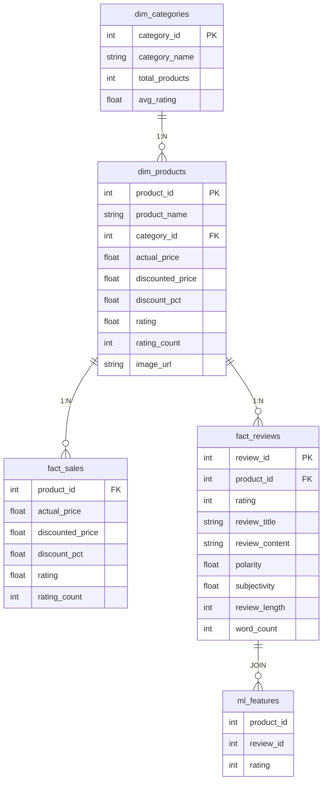

# Modelagem dbt

[[Home|Voltar ao índice]]

---

## Schema Estrela



---

## Modelos por Camada

| Camada | Modelo | Arquivo | Descrição |
|--------|--------|---------|-----------|
| **Staging** | `stg_products` | `models/staging/stg_products.sql` | Renomeia, tipa, deduplica `ml_features.csv` |
| **Staging** | `stg_reviews` | `models/staging/stg_reviews.sql` | Renomeia, tipa, deduplica reviews |
| **Staging** | `stg_images` | `models/staging/stg_images.sql` | Renomeia, tipa, deduplica features de imagem |
| **Dimension** | `dim_products` | `models/dimensions/dim_products.sql` | Dimensão de produtos, SCD Type 1 |
| **Dimension** | `dim_categories` | `models/dimensions/dim_categories.sql` | Categorias únicas com métricas agregadas |
| **Fact** | `fact_reviews` | `models/facts/fact_reviews.sql` | Reviews com features NLP + imagem |
| **Fact** | `fact_sales` | `models/facts/fact_sales.sql` | Métricas de venda por produto |
| **Mart** | `ml_features` | `models/marts/ml_features.sql` | JOIN final: features prontas para ML |

---

## Testes dbt (`schema.yml`)

```yaml
version: 2

models:
  - name: dim_products
    columns:
      - name: product_id
        tests:
          - not_null
          - unique

  - name: fact_reviews
    columns:
      - name: review_id
        tests:
          - not_null
      - name: rating
        tests:
          - not_null
          - accepted_values:
              values: [1, 2, 3, 4, 5]

  - name: dim_categories
    columns:
      - name: category_name
        tests:
          - unique
```

---

## Estrutura do Projeto dbt

```
dbt_project/
├── dbt_project.yml
├── packages.yml
├── profiles.yml
├── models/
│   ├── staging/
│   │   ├── stg_products.sql
│   │   ├── stg_reviews.sql
│   │   └── stg_images.sql
│   ├── dimensions/
│   │   ├── dim_products.sql
│   │   └── dim_categories.sql
│   ├── facts/
│   │   ├── fact_reviews.sql
│   │   └── fact_sales.sql
│   └── marts/
│       └── ml_features.sql
├── macros/
├── tests/
│   └── schema.yml
└── docs/
```

---

## Comandos dbt

```bash
make dbt-run      # dbt run
make dbt-test     # dbt test
make dbt-docs     # dbt docs generate && dbt docs serve
```
