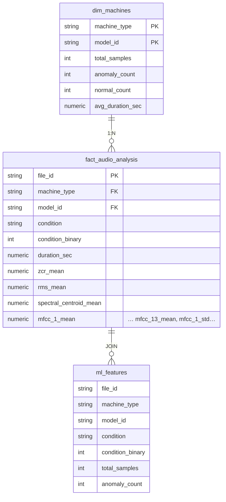

# Modelagem dbt

[[Home|Voltar ao índice]]

---

## Schema Estrela



---

## Modelos por Camada

| Camada | Modelo | Arquivo | Tipo | Descrição |
|--------|--------|---------|------|-----------|
| **Staging** | `stg_pump_metadata` | `models/staging/stg_pump_metadata.sql` | View | Limpeza, dedup (`distinct on file_id`) e tipagem dos metadados |
| **Staging** | `stg_audio_features` | `models/staging/stg_audio_features.sql` | View | Cast para `numeric` das features de áudio |
| **Dimension** | `dim_machines` | `models/dimensions/dim_machines.sql` | Table | Agregação por modelo: total, anomalias, normais, duração média |
| **Fact** | `fact_audio_analysis` | `models/facts/fact_audio_analysis.sql` | Table | Join completo dos dados (condição + features de áudio) |
| **Mart** | `ml_features` | `models/marts/ml_features.sql` | Table | Join com `dim_machines`, pronto para ML |

A origem dos dados é a tabela `public.ml_features_raw` (carregada por `processing/load_to_postgres.py`).

---

## Testes dbt (`tests/schema.yml`) — 16 testes

| Modelo | Coluna | Testes |
|--------|--------|--------|
| `stg_pump_metadata` | `file_id` | `not_null`, `unique` |
| `stg_pump_metadata` | `machine_type` | `not_null` |
| `stg_pump_metadata` | `model_id` | `not_null` |
| `stg_pump_metadata` | `condition` | `not_null`, `accepted_values: [normal, anomaly]` |
| `stg_audio_features` | `file_id` | `not_null`, `unique` |
| `dim_machines` | `machine_type` | `not_null` |
| `dim_machines` | `model_id` | `not_null` |
| `dim_machines` | `total_samples` | `not_null` |
| `fact_audio_analysis` | `file_id` | `not_null`, `unique` |
| `fact_audio_analysis` | `condition_binary` | `not_null`, `accepted_values: [0, 1]` |
| `ml_features` | `condition_binary` | `not_null` |

---

## Estrutura do Projeto dbt

```
dbt_project/
├── dbt_project.yml       # staging=view, dim/facts/marts=table
├── profiles.yml          # dev (postgres) e prod (snowflake)
├── models/
│   ├── staging/
│   │   ├── stg_pump_metadata.sql
│   │   └── stg_audio_features.sql
│   ├── dimensions/
│   │   └── dim_machines.sql
│   ├── facts/
│   │   └── fact_audio_analysis.sql
│   └── marts/
│       └── ml_features.sql
└── tests/
    └── schema.yml
```

---

## Comandos dbt

```bash
make dbt-run      # dbt run
make dbt-test     # dbt test
make dbt-docs     # dbt docs generate && dbt docs serve
```
