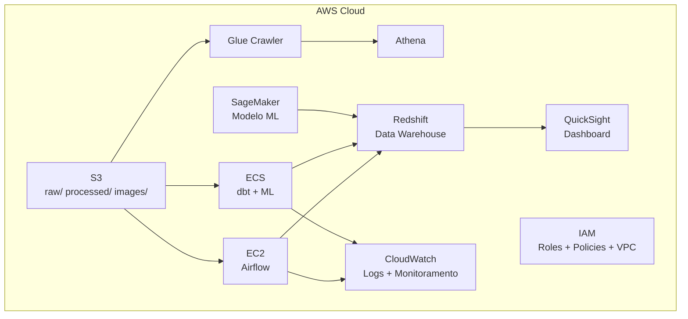

# Infraestrutura AWS — CloudFormation

[[Home|Voltar ao índice]]

---

## Recursos do CloudFormation

**Arquivo:** `infra/cloudformation.yaml`

| Recurso AWS | Propósito | Tipo CF |
|-------------|-----------|---------|
| **S3 Bucket** | Armazenamento raw/processed/images | `AWS::S3::Bucket` |
| **EC2 Instance** | Airflow (t3.medium) | `AWS::EC2::Instance` |
| **ECS Cluster** | Cluster para tasks dbt + Python | `AWS::ECS::Cluster` |
| **ECS Task Definition** | Definição das tasks de processamento | `AWS::ECS::TaskDefinition` |
| **Redshift Cluster** | Data Warehouse (substituto Snowflake) | `AWS::Redshift::Cluster` |
| **SageMaker Notebook** | Treinamento do modelo ML | `AWS::SageMaker::NotebookInstance` |
| **CloudWatch Logs** | Monitoramento e logs | `AWS::Logs::LogGroup` |
| **IAM Roles** | Permissões entre serviços | `AWS::IAM::Role` |
| **VPC** | Rede isolada | `AWS::EC2::VPC` |
| **Subnets** | Sub-redes pública e privada | `AWS::EC2::Subnet` |
| **Security Groups** | Firewall e regras de acesso | `AWS::EC2::SecurityGroup` |

> [!info] Observação
> QuickSight e Metabase não possuem recurso nativo no CloudFormation — configuração manual.

---

## Arquitetura Acadêmica (100% AWS)

---

## Na Prática

> [!warning] Apenas S3 é usado como serviço real
> O CloudFormation completo é um **exercício acadêmico** para demonstrar conhecimento da plataforma AWS. No projeto real:
> - **S3** → Serviço real (produção)
> - **PostgreSQL local** → Substitui Redshift/Snowflake (dev)
> - **Airflow local** → Substitui EC2
> - **Scripts Python locais** → Substitui ECS
> - **Metabase local** → Substitui QuickSight
> - **Treinamento local** → Substitui SageMaker

---

## Diagrama da Arquitetura

O diagrama visual deve ser gerado como `infra/architecture_diagram.png` e mostrar:

1. Fluxo de dados (Ingest → Process → Transform → ML → Dashboard)
2. Serviços AWS envolvidos
3. Substituições locais para cada serviço
4. Comunicação entre componentes
