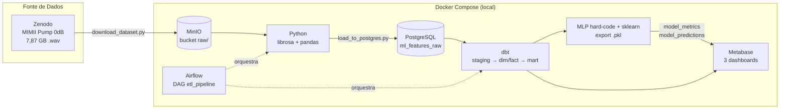
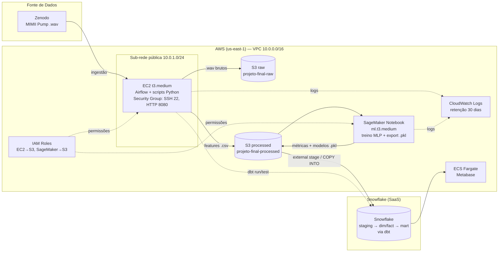

# Arquitetura da Solução — Local (dev) e 100% AWS (prod)

Este documento atende ao requisito 4.5 do projeto: diagrama arquitetural da
solução equivalente **totalmente em serviços da AWS**, documentação da
organização dos dados e **registro de custos aproximados**.

## 1. Arquitetura desenvolvida (ambiente local — dev)

O ambiente local reproduz a arquitetura de nuvem com serviços equivalentes em
Docker. A troca dev → prod é feita **apenas por variáveis de ambiente**
(`.env.local` → `.env.prod`), sem mudança de código.



| Papel | Local (dev) | AWS (prod) |
|---|---|---|
| Object storage | MinIO | Amazon S3 |
| Base analítica | PostgreSQL 16 | Snowflake (ou Amazon Redshift) |
| Orquestração | Airflow em Docker | Airflow em EC2 (ou MWAA) |
| Processamento | Python local | EC2 / SageMaker |
| Dashboard | Metabase em Docker | Metabase em ECS (ou QuickSight) |
| Logs | stdout dos containers | CloudWatch Logs |

## 2. Arquitetura equivalente 100% AWS

Provisionada pelo template `infra/cloudformation.yaml` (VPC, S3, EC2, IAM,
SageMaker, CloudWatch). O Snowflake é SaaS externo que lê os dados via
integração com S3 (external stage).



### Fluxo de dados na AWS

1. **Ingestão** — EC2 baixa o dataset do Zenodo e grava os `.wav` em `s3://projeto-final-raw/pump/`.
2. **Processamento** — scripts Python (EC2) extraem metadados dos paths e 92 features de áudio com librosa, gravando CSVs em `s3://projeto-final-processed/`.
3. **Carga analítica** — Snowflake lê os CSVs do S3 (external stage + `COPY INTO`) para a tabela `ml_features_raw`.
4. **Transformação** — dbt (rodando no EC2, target `prod` do `profiles.yml`) materializa staging → dimensions → facts → marts e executa os testes de qualidade.
5. **ML** — SageMaker Notebook treina o MLP (hard-code e sklearn), exporta modelos `.pkl` e grava métricas/predições de volta no S3/Snowflake.
6. **Visualização** — Metabase (ECS Fargate) conecta no Snowflake e serve os 3 dashboards com filtro por modelo de máquina.
7. **Monitoramento** — CloudWatch centraliza logs do Airflow e do SageMaker (Log Group `/projeto-final/{env}/application`).

### Organização dos dados (camadas)

```
s3://projeto-final-raw-{env}-{account}/
└── pump/id_XX/{normal|abnormal}/*.wav     # dado bruto, imutável, versionado

s3://projeto-final-processed-{env}-{account}/
├── pump_metadata.csv                      # dados estruturados (parse dos paths)
├── audio_features.csv                     # features extraídas (librosa)
├── ml_features.csv                        # dataset final para ML
└── models/*.pkl                           # modelos treinados exportados

Snowflake:
├── RAW.ml_features_raw                    # carga bruta
├── STAGING.stg_pump_metadata / stg_audio_features   (views)
├── ANALYTICS.dim_machines / fact_audio_analysis     (tables)
└── ANALYTICS.ml_features                  # mart p/ ML e dashboard
```

## 3. Registro de custos aproximados (us-east-1, uso acadêmico)

Estimativa para o cenário do projeto: dataset de ~8 GB, pipeline executado
algumas vezes por semana, ambiente ligado ~8h/dia útil (~176 h/mês).

| Serviço | Dimensionamento | Custo mensal estimado (US$) |
|---|---|---|
| S3 Standard (raw + processed) | ~10 GB + requests | ~0,25 |
| EC2 t3.medium (Airflow + scripts) | 176 h × $0,0416/h | ~7,30 |
| EBS gp3 30 GB (root da EC2) | 30 GB × $0,08 | ~2,40 |
| SageMaker Notebook ml.t3.medium | 20 h × $0,05/h | ~1,00 |
| CloudWatch Logs | ~1 GB ingerido, retenção 30 dias | ~0,50 |
| ECS Fargate (Metabase, 0.5 vCPU/1GB, 176 h) | | ~9,00 |
| VPC / IGW / IAM / CloudFormation | sem custo direto | 0,00 |
| **Subtotal AWS** | | **~20,50** |
| Snowflake X-Small (SaaS, fora da AWS) | ~10 h de warehouse × $2/crédito | ~20,00 |
| **Total da solução** | | **~40,50/mês** |

Observações:

- Rodando 24/7, a EC2 sobe para ~$30/mês e o Fargate para ~$18/mês — desligar fora do horário de uso é a principal alavanca de economia.
- O tier gratuito da AWS (12 meses) cobre parte da EC2 (750 h de t2/t3.micro) e do S3 (5 GB), reduzindo o custo real de um ambiente acadêmico para perto de zero se dimensionado para micro.
- Alternativa serverless: substituir a EC2 por MWAA custa mais (~$350/mês mínimo) — para escala acadêmica, EC2 self-managed é a opção econômica correta.
- Download do dataset (7,87 GB) gera custo de transferência **de entrada** zero; saída de dados do S3 para internet custaria ~$0,09/GB se necessário.

## 4. Segurança básica e reprodutibilidade

- **IAM com menor privilégio:** roles separadas para EC2 e SageMaker, restritas aos dois buckets do projeto.
- **Rede:** VPC própria com sub-rede pública (Airflow UI) e privada (reservada para banco/processamento interno); Security Group libera apenas portas 22 e 8080.
- **Credenciais:** nunca em código — env vars locais (`.env.*`, fora do git) e parâmetro `NoEcho` (senha) no CloudFormation.
- **Versionamento:** buckets S3 com versioning habilitado; infraestrutura inteira reproduzível com um comando:

```bash
aws cloudformation deploy \
  --template-file infra/cloudformation.yaml \
  --stack-name projeto-final \
  --parameter-overrides Environment=dev DBPassword=<senha> KeyName=<keypair> \
  --capabilities CAPABILITY_NAMED_IAM
```
